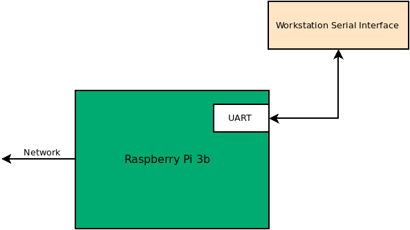
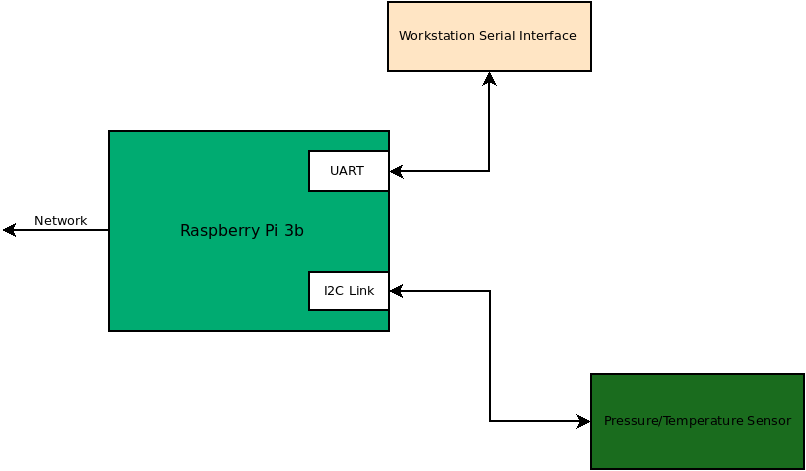
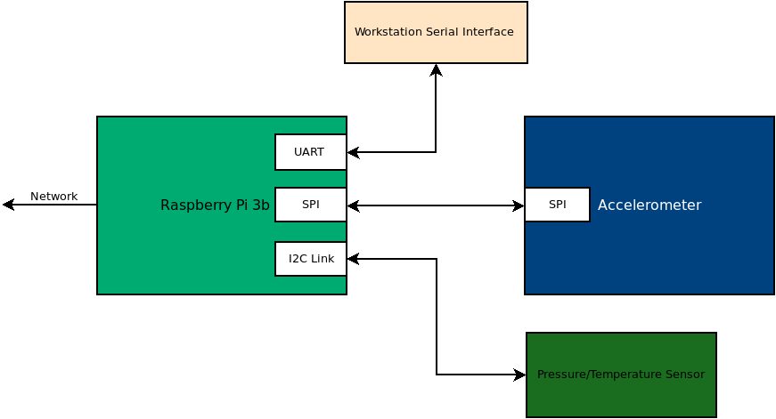

# Cyber-Physical System Introduction

## P0/P1/P2/P3 System Overview

In **Project 0**, **Project 1**, **Project 2**, and **Project 3**, you will be working
with a partner to create a cyber-physical system. This system will
involve a [Raspberry Pi 3B board](https://www.raspberrypi.org/) and  a
pressure/temperature sensor. The
system that you create will explore the use of different types of
communication busses to interact with devices. You will be using the
following interfaces:
[UART](https://en.wikipedia.org/wiki/Universal_asynchronous_receiver-transmitter),
[I2C](https://en.wikipedia.org/wiki/I%C2%B2C), and
[SPI](https://en.wikipedia.org/wiki/Serial_Peripheral_Interface). Additionally,
you will be creating a network interface to your system to allow user
interaction and data collection.

In **Project 0**, you will be connecting to your Raspberry Pi over the
UART. Once you are up and running on the Raspberry Pi, you will be
cloning your repository in preparation for the other projects.

In **Project 1**, you will be adding a pressure/temperature sensor to
your system. This sensor will be connected to your Raspberry PI via
the I2C interface. You will be creating a python module to enable
interaction with the sensor.

In **Project 2**, you will using the SPI interface to read from an accelerometer. 

In **Project 3**, you will be using the wifi interface on the
raspberry pi to enable user interactions with the
device. Specifically, you will create system interfaces in python
using [Redis](https://redis.io/) and
[Flask](https://en.wikipedia.org/wiki/Flask_(web_framework)).

## Project 0

### Overview

In Project 0, you will be utilizing a Raspberry Pi board connected via
a UART serial port. This interface will allow you to interact with the
board from the command line as you would a typical linux system. You
will use this connection to setup a wireless network connection to
your board. Once you have a network connection, you will use this
connection to clone your class git repository.

### Resources

* [Pi Setup Slides](docs/pi_serial_setup.pdf)
* [ProGit Book CH1-3](https://git-scm.com/book/en/v2)
* [Markdown
Format](https://guides.github.com/features/mastering-markdown/)

### Raspberry Pi Setup

In this section, you will connect the USB-UART interface to the
Raspberry Pi, power the system, and then log into the device. The
following is a sequence of videos that explain how to get your
Raspberry Pi setup. These videos reference the following slides: [Pi Serial Setup](docs/pi_serial_setup.pdf)

In these next pair of videos, you will be logging into the Rasberry Pi
system that you have now connected via the USB-Serial cable. You
should have also power the system with the provided wall wart port
supply.

Setting up Putty and Screen:

Walkthrough of connecting to the Pi:

Connecting to a wireless network:

### Git and Github

You will be using git to move files on and off your Raspberry Pi. If
you are unfamiliar with git or just need a refresher, please read
chapters 1-3 in the
[ProGit](https://git-scm.com/book/en/v2). Investing early in learning
this version control system will make these project run much more
smoothly.

### Github Setup 

You and your partner will share one github repository for the P5-P8
lab sequence. This repository will be setup on the [IU Enterprise
Github](https://kb.iu.edu/d/bagk) site. Decide which partner will be
creating the repository. This partner should create a **private**
repository named **CPS-Digital-Design**. You should add the following
collaborators to your repository:

* *Your partner*
* **ccfernan**
* **ncm1**
* **mvidali**
* **bhimebau**

Once you have created your repository, you should clone it on your
Raspberry Pi. It is recommended that you use https for cloning this
repository.

### What to turn in

Create a file named README.md. You may have created this automatically
when the repository was created. This file is in [markdown
format](https://guides.github.com/features/mastering-markdown/). You
will be using this file as a log of activities. 

At the top of the README.md file put the names of both partners and
the white tag number from your raspberry pi (barcode on the
USB/Ethernet connectors of the board).

For this lab, please note the
time/date/contributor/accomplishment. You should use a markdown table
(see markdown reference) for this purpose. The table should be
formatted similarly to the following:

Date | Time | Contributor | Accomplishment
-----|------|-------------|---------------
3/08/2021|9:00 am| Bryce Himebaugh | Completed P5 Project Document

Once you have updated this file, commit and push it to your
repository. **Both you and your partner should submit a link to your
repository in canvas.**

