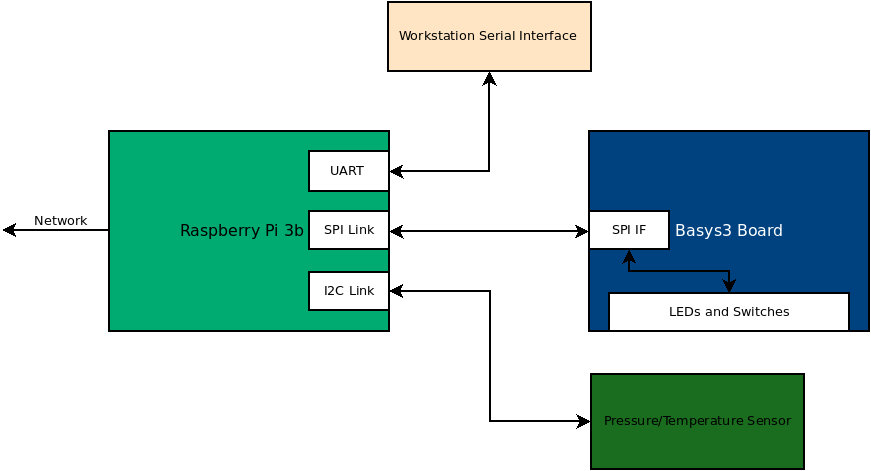

# Connecting the ADXL343 Accelerometer board to the PI 

## Project 2

### Overview

In this project, you will be connecting an accelerometer board to the
Raspberry Pi. In the last lab, we used I2C to talk to the pressure
sensor. In this lab, we are going to be using Serial Peripheral
Interface (SPI) to connect to the ADXL343 accelerometer. You will be
creating a python class that enables the raspberry pi to interact with
the accelerometer.

### Resources
* [Adafruit ADXL343 Reference](https://learn.adafruit.com/adxl343-breakout-learning-guide)

### Connecting the sensor board

You will be adding the accelerometer to the same breadboard as the pressure sensor. 

| Raspberry Pi Pin  | ADXL343 Board  |
|-------------------|----------------|
| 5V                | VIN            |
| GND               | GND            |
| Pin 19 (SPI MOSI) | SDA            |
| Pin 21 (SPI MISO) | SDO/ALT ADDR   |
| Pin 23 (SPI SCK)  | SCL            |
| Pin 24 (SPI CE0)  | CS             |

### Requirements for the python class 

### What to turn in 

You and your partner should work to complete this module and commit it
to your repository. When you are satisfied with the code, go to canvas
and submit a video of your system running. The video should show
operation at 3Hz and at 10Hz. At a given frequency, it should be
demonstrated that the switch can control the direction that the LEDs
are cycling.
