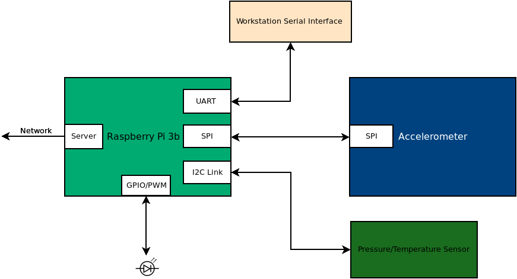
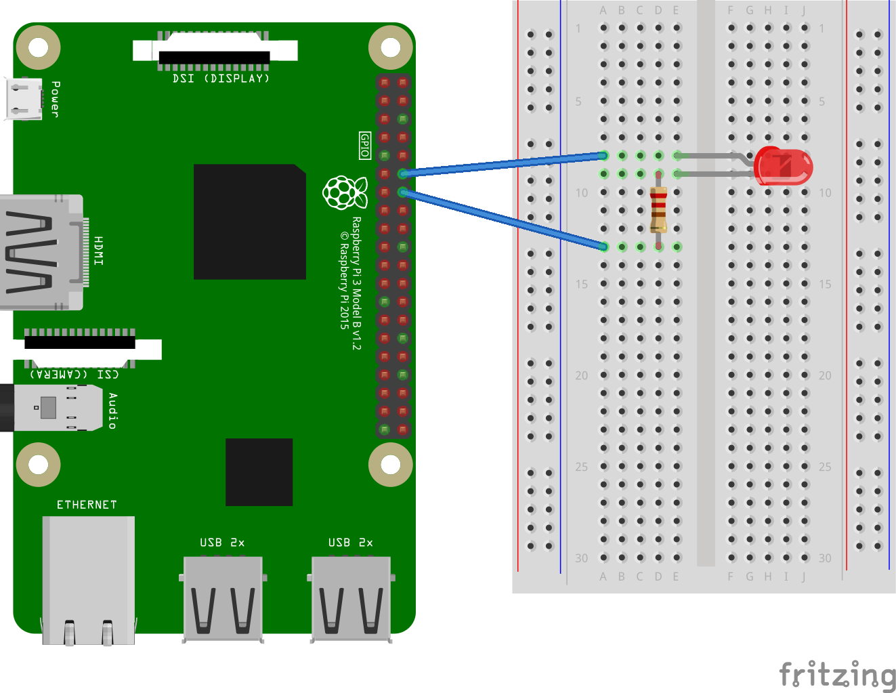

# LED/MQTT/Flask



## Project 4

### Overview

In this project, you will be adding an LED to your system that you can
control through MQTT. You will be creating a class that allows you to
set the PWM duty cycle and frequency for a GPIO pin attached to an
LED. Additionally, you will be modifying your **sensor_node.py** code
to enable changing these values though MQTT. 

### Resources
* [GPIO/PWM/LED Lecture](https://engr210.github.io/lectures/GPIO_LED.pdf)

### LED Wiring 

Connect your LED and resistor to pin GPIO18. The LED and resistor are
connected between GPIO18 and ground.



### Led_Driver Class Development

Create a class named "Led_Driver" that allows a pin to be controlled
as a PWM. The following template will give you a starting point for
designing this class. Name this file led_driver.py and add it to the
same folder as your sensor_node.py code.

```python 

#!/usr/bin/env python3

import RPi.GPIO as GPIO

class Led_Driver:
	def __init__(self, pin, frequency=100):
		self.pin = pin
		self.frequency = frequency
		self.duty = 0
		GPIO.setwarnings(False)
		GPIO.setmode(GPIO.BCM)
		GPIO.setup(self.pin,GPIO.OUT)
		self.pwm_out = GPIO.PWM(self.pin,self.frequency)
		self.pwm_out.start(0)
	  
	def on(self, duty=100):
		self.pwm_out.ChangeDutyCycle(duty)
		self.duty = duty

	def off(self):
		self.pwm_out.ChangeDutyCycle(0)
		self.duty = 0
		
	def change_frequency(self, frequency):
		self.pwm_out.ChangeFrequency(frequency)
		self.frequency = frequency 

	def __str__(self):
		outstr = f"Pin = {self.pin}\n"
		outstr += f"Frequency = {self.frequency}\n"
		outstr += f"Duty = {self.duty}\n"
		return outstr


if __name__ == '__main__':
	bcm_pin = 18
	freq = 100
	led = Led_Driver(bcm_pin, freq)
	input("Initialized, Hit a Key for 100% Duty Cycle: ")
	led.on(100)
	print(led)
	input("Hit a Key for 75% Duty Cycle: ")
	led.on(75)
	print(led)
	input("Hit a Key for 50% Duty Cycle: ")
	led.on(50)
	print(led)
	input("Hit a Key to change Frequency to 5 Hz with 50% duty cycle: ")
	led.change_frequency(5)
	print(led)
	input("Hit a Key to change back to 100 Hz with 50% duty cycle: ")
	led.change_frequency(100)
	print(led)
	input("Hit a Key for 25% Duty Cycle: ")
	led.on(25)
	print(led)
	input("Hit a Key for 0% Duty Cycle: ")
	led.off()
	print(led)
	input("Hit a Key to exit ")

```

### Led Duty Cycle and Frequency MQTT Topics

The **on_connect** method that was included in the code template from
lab 3, subscribe to a topics named
**"sensors/your-sensor-serial-number/led/duty"** and
**"sensors/your-sensor-serial-number/led/duty"**. You should add the
following subscription line to your **on_connect** function.

```python 

topics = [(f"sensors/{sensor_id}/led/duty",0),(f"sensors/{sensor_id}/led/frequency",0)]
client.subscribe(topics)
``` 
Uncomment the printing of the **topic** in the on_message
function. Start the sensor_node.py program. Use mosquitto_pub to send
messages to the led topics that you subscribed to above. Confirm that
you are getting these messages.

### Controlling the Led Driver using MQTT Messages 

Import your led_driver into the sensor_node.py code. Initialize your led. When an MQTT message comes in related to the led, make the requested change to the led state. 

In the loop where you are publishing sensor data, add one additional publication line to indicate the status of the led. This code assumes that your led instance is named **led**. If it not, change the code accordingly. 

```python

client.publish(f"sensors/{sensor_id}/led/status",f"duty:{led.duty},frequency:{led.frequency}")
```
Using mosquitto_pub, demonstrate that you can set the duty cycle of
the LED at 0%, 50%, and 100%. Also demonstrate that you can set the
frequency of the led to 100 hz and 5 hz.

### What to turn in 

You and your partner should work to complete this module and commit it
to your repository. When you are satisfied with the code, go to canvas
and submit a video of your system running. The video should show the
additional led status topic being published from your sensor along
with the temperature, pressure, and accelerometer messages. Filter the
data such that you are only displaying data from your sensor.


