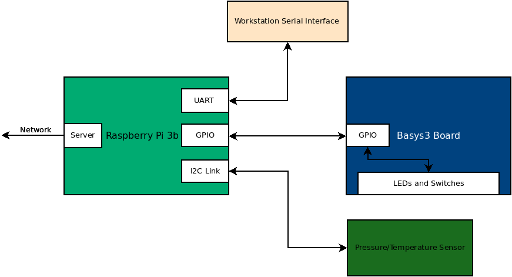

# Reading and Writing to the System using MQTT



## Project 8

### Overview

In this project, you will be connecting your system to a sensor
network via the MQTT protocol. This will involve creating a python
script that communicates the current temperature, pressure, and switch
state to the mqtt broker. The system will will receive the LED number
to light the appropriate led.

### Resources
* [MQTT Lecture](https://engr210.github.io/lectures/MQTT.pdf)
* [MQTT Text](https://iucat.iu.edu/catalog/18457908) 

### Packages to Installing 

You will need to install a couple of packages on your raspberry pi. These packages are as follows: 

```bash
sudo apt-get install python3-paho-mqtt mosquitto-clients
```
### Mosquitto Pub/Sub 

Once you have installed the packages above on your raspberry pi, you
will be able to run **mosquitto_pub** and **mosquitto_sub**. You can
find notes on how to use these commands in the reference materials
above along with the video from the MQTT lecture.

One of the items that you are required to turn in is a video of
receiving and transmitting messages from silo. To run **mosquitto_pub**
and **mosquitto_sub** on silo, you will need to load a module.

```bash
module load mqtt
```

You can run this command for every shell where you want to run the
mosquitto commands. Alternatively, you can add it to your .bashrc file
in your silo home directory.

### Sensor Template Code 

The following code is a template to get you started on your own
version of **sensor_node.py**. This code writes static variables to
the mqtt broker.

**The first thing that you should do in modifying this code is to
change sensor_id. This is the 6 digit number on the white IU tag on
your pi. This tag has a barcode on it.**

```python 

#!/usr/bin/env python3

import paho.mqtt.client as mqtt
import time

# White Bar Code Label Number on Each Raspberry Pi
sensor_id = 986304
temperature = 21
pressure = 31
switch = 0

def on_message(client, userdata, message):
#    print("topic:", message.topic)
    print("message:", message.payload.decode('UTF-8'))

def on_connect(client,userdata,flags,rc):
    client.subscribe(f"sensors/{sensor_id}/led")
    
client = mqtt.Client()
client.on_message=on_message
client.on_connect=on_connect
client.connect("pivot.iuiot.org")
client.loop_start()
while(1):
    print("Publish Temperature, Pressure, and Switch Data")
    client.publish(f"sensors/{sensor_id}/temperature",f"{temperature}")
    client.publish(f"sensors/{sensor_id}/pressure",f"{pressure}")
    client.publish(f"sensors/{sensor_id}/switch",f"{switch}")
    time.sleep(15)
```

### Adding Live Data 

In labs 6 and 7, you created classes that enable access to the
pressure/temperature sensor and the fpga. In this lab, you will be
using these classes to get the data needed to pass to the mqtt broker.

**You should copy your lps331ap.py and Basys3_LEDSW.py files to the
same directory as sensor_node.py.**

You will be writing the temperature, pressure, and switch values to
the mqtt topics shown in the template code. You will be receiving a
number on the sensors/SENSOR_ID/led topic (focus on the *on_message*
function above). The value that you receive in this message should be
converted to an integer, range tested, and then written to the
fpga. Values that are out of range can be ignored.

As with the template, the data published from this sensor will be sent
every 15s. The led should be updated directly after the message is
received.

### What to turn in 

You and your partner should work to complete this module and commit it
to your repository. When you are satisfied with the code, go to canvas
and submit a video of your system running. The video should show the
temperature, pressure, and switch messages arriving on the mqtt broker
pivot.iuiot.org (recall that you can use a wildcard to filter just
these messages). 

You should use mosquitto_sub on **silo** to subscribe to all of the
messages from your sensor. You should also demonstrate that you can
use mosquitto_pub on **silo** to set the leds on your fpga board.


