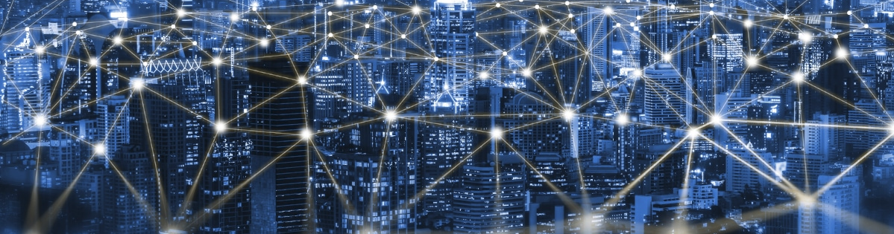

# Welcome to Engineering Cyber-Physical Systems (E210/B441)
### Spring 2023

## Description

This course provides an introduction to core topics in cyber-physical and digital systems. The
first part of the course provides a foundation for modern cyber-physical system design. These
topics include embedded systems, issues of real-time processing, and sensor mechanisms and
control algorithms. Students will study applications of these elements in the Internet of Things
and Robotics.
The second part of the course covers digital system design using hardware description
languages. We start with basics of digital electronics and learn how digital gates are used to
build large digital systems. We will practice modern digital system design by using state of the
art software tools and implementation of the digital systems on a programmable hardware
platform.

## Goals

Our basic goal is to teach the students how to design and implement digital and cyber-physical
systems. You will learn how to efficiently use state-of-the-art tools to design and produce well
engineered systems. The course will also prepare you to take the upper-level systems classes
and, even more important, you will learn skills and knowledge that will help you throughout
your career.

## Quick Links

### [Syllabus](syllabus.pdf)

### [Downloads](http://github.com/engr210/downloads) 

### [Autograder](https://autograder.luddy.indiana.edu) _(registered students only)_

### [Canvas](https://iu.instructure.com/courses/2119511) _(registered students only)_

#### [Remote Setup](https://uisapp2.iu.edu/confluence-prd/pages/viewpage.action?pageId=280461906)

#### [Vivado Tutorial](projects/vivado_tutorial) 

<!-- [P5 - Raspberry Pi Setup](P5.md) -->

## Classes and Labs Schedule

| Weekly Focus      | Monday| Wednesday | Lab (Wednesday, Friday)|
|-------------------|------------------------------------------------------------------         |--------------------------------------------------------------     |-----------------------------------------------|
| Introduction and Standard I/O    | **1/9** | **1/11**| [**Project 0 Raspberry PI Setup**](projects/P0) |
| I2C Serial communication | **1/16: MLK Day** No classes| **1/18**| [**Project 1 I2C Pressure/Temperature Sensor**](projects/P1)|
| Pressure sensor and SPI bus | **1/23**| **1/25**| [**Project 2 SPI Accelerometer**](projects/P2) |
| Accelerometer and MQTT| **1/30**| **2/1**| [**Project 3 MQTT Sensor Data Server**](projects/P3) |
|Parallel input/output| **2/6**| **2/8**|[**Project 4 Sensor LED Output**](projects/P4)  |
| CPS Wrap-up | **2/13**| **2/15: Exam 1 Review**| No Labs |
|Evaluation| **2/20: Exam 1** | **2/22:** Intro. to Digital Design |[P5 Demultiplexer](projects/P5)|
|Verilog| **2/27**| **3/1**|  <!--**[P6 ALU](projects/P6)**-->|
|Test benches and combinational logic|**3/6**  | **3/8** | |
|Spring Break| **3/13:** No Classes | **3/15:** No Classes | |
|Sequential Logic  | **3/20**  | **3/22**  | No Labs |
|Finite state machines (FSM's)| **3/27** | **3/29**   |<!-- **[P7 Elevator Controller](projects/P7)**--> |
| FSM's Cont. | **4/3** | **4/5** | <!--**[P7 Elevator Controller](projects/P7)**--> |
| Serial communication | **4/10**  | **4/12** | <!-- **[P8 SPI Interface](projects/P8)** -->  |
|Memories| **4/17**   | **4/19**  | <!--  **[P8 SPI Interface](projects/P8)**-->  |
|Evaluation| **4/24 Exam 2 Review**   | **4/26: Exam 2**  |  |

<!-- [Old Projects](legacy/old_projects.md) -->
<!-- **[P7 Saturating Counter](https://docs.google.com/document/d/1JLgk0VguSrih_h3BsMyMtInTJ4Qrl--Hv2jkxK4chZw)** -->
