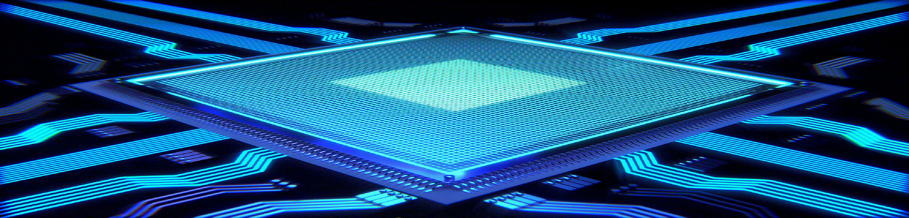

# Welcome to ENGR 210 ( CSCI B441 )

Spring 2023

## Description

This course provides an introduction to core topics in cyber-physical and digital systems. The
first part of the course provides a foundation for modern cyber-physical system design. These
topics include embedded systems, issues of real-time processing, and sensor mechanisms and
control algorithms. Students will study applications of these elements in the Internet of Things
and Robotics.
The second part of the course covers digital system design using hardware description
languages. We start with basics of digital electronics and learn how digital gates are used to
build large digital systems. We will practice modern digital system design by using state of the
art software tools and implementation of the digital systems on a programmable hardware
platform.

## Goals

Our basic goal is to teach the students how to design and implement digital and cyber-physical
systems. You will learn how to efficiently use state-of-the-art tools to design and produce well
engineered systems. The course will also prepare you to take the upper-level systems classes
and, even more important, you will learn skills and knowledge that will help you throughout
your career.

## Quick Links

### [Syllabus](syllabus.pdf)

### [Downloads](http://github.com/engr210/downloads) 

### [Autograder](https://autograder.sice.indiana.edu) _(registered students only)_

### [Canvas](https://iu.instructure.com/courses/2119511) _(registered students only)_

#### [Remote Setup](https://uisapp2.iu.edu/confluence-prd/pages/viewpage.action?pageId=280461906)

#### [Vivado Tutorial](vlog/projects/A_Logic_Gates) 

<!--
[P5 - Raspberry Pi Setup](P5.md)
-->

<!-- ## Course Schedule -->

<!-- | Weekly Focus      | Monday                                                                    | Wed                                                               | Lab                                           |
|-------------------|------------------------------------------------------------------         |--------------------------------------------------------------     |-----------------------------------------------|
| CPS Intro/UART    | **1/10:** [CPS Introduction](lectures/CPS_Introduction.pdf)               | **1/12:** [Pi Intro/UART Bus](lectures/RaspberryPi_UART.pdf)      | [**Project 0 Raspberry PI Setup**](P0) |
| I2C Bus           | **1/17:** MLK Day                                                         | **1/19:** [I2C Bus Overview](lectures/I2C_Introduction.pdf)       | [**Project 1 I2C Pressure/Temperature Sensor**](P1)               |
| I2C and SPI Bus   | **1/24:** [Pressure Sensor](lectures/LPS331AP_Pressure_Sensor_SP22.pdf)   | **1/26:** [SPI Bus Overview](lectures/SPI_bus_SP22.pdf)           | [**Project 2 SPI Accelerometer**](P2) |
| SPI/Networking    | **1/31:** [Accelerometer](lectures/Accelerometer_SP22.pdf)                | **2/2:** [MQTT](lectures/MQTT_SP22.pdf)                           | [**Project 3 MQTT Sensor Data Server**](P3) |
| Networking        | **2/7:** [GPIO/LED](lectures/GPIO_LED.pdf)                                | **2/9:** [Flask](lectures/Flask_sp22.pdf)                         | [**Project 4 Sensor LED Output**](P4) |
| Web Server        | **2/14:** No Class                                                        | **2/16:** [CPS Wrapup](lectures/CPS_Wrapup_SP22.pdf), [Exam Review](exam1) | None |
| Evaluation        | **2/21:** Exam 1                                                          | **2/23:** [CE Intro/ Logic](lectures/00_Logic_Gates.pdf)          | **[P5 Demultiplexer](vlog/projects/B_Demultiplexer)** |
| CPE Intro/Logic   | **2/28:** [Truth Tables](lectures/01_Truth_Tables.pdf)                    | **3/2:** [Verilog Basics](lectures/02_Verilog_Basics.pdf)         | **[P6 ALU](https://docs.google.com/document/d/1uhQR3LDZLIDAheTqNy58HJ456uEFfEh4IH7j1ZReyHM)**|
| Combinational Logic|**3/7:**  [Testbenches](lectures/03_Testbenches.pdf)                      | **3/9:** [Math](lectures/04_Math.pdf)                             |  **[P7 Saturating Counter](https://docs.google.com/document/d/1JLgk0VguSrih_h3BsMyMtInTJ4Qrl--Hv2jkxK4chZw)**|
|                   | **3/14:** Spring Break                                                    | **3/16:** Spring Break                                            |                                               |
| Sequential Logic  | **3/21:** [Latches](lectures/05_Latches.pdf)                              | **3/23:** Exam Review                                             | **[P7 Saturating Counter](https://docs.google.com/document/d/1JLgk0VguSrih_h3BsMyMtInTJ4Qrl--Hv2jkxK4chZw)**|
| FSMs              | **3/28:** [Flops](lectures/06_Flops.pdf)                                  | **3/31:** [Sequential Logic](lectures/07_Sequential_Logic.pdf)          | **[P8 Elevator Controller](https://docs.google.com/document/d/1IdqlRf4rqOpv0cBeurJ29rpMXwudnfIx8i1Z8IPmqxI)**|
| FSMs              | **4/4:** [FSMs I](lectures/08_FSM_I.pdf)                                  | **4/6:** [FSMs II](lectures/09_FSM_II.pdf)                       | **[P8 Elevator Controller](https://docs.google.com/document/d/1IdqlRf4rqOpv0cBeurJ29rpMXwudnfIx8i1Z8IPmqxI)**|
| FSM/Timing        | **4/11:** [Timing / SPI](lectures/10_SPI_I.pdf)                           | **4/13:** [SPI _II](lectures/11_SPI_II.pdf)                         |  **[P9 SPI Interface](https://docs.google.com/document/d/1g8SYZxxi9_tiL3w2Q35Vs9CSczaZlnP3c5YszmsfWVg)** |
| SPI Implementation| **4/18:** [SPI III](lectures/12_SPI_III.pdf)                              | **4/20:** [Memory](lectures/13_Memory.pdf)                        |   **[P9 SPI Interface](https://docs.google.com/document/d/1g8SYZxxi9_tiL3w2Q35Vs9CSczaZlnP3c5YszmsfWVg)** |
| Review            | **4/25:** None                                                            | **4/27:** [Review](lectures/14_Review.pdf)                        |                                               |
|                   | **5/06:** (Friday) Final Exam @ 12.40-2:40pm                         |                                                                   |                                               |

 -->

<!-- [Old Projects](old_projects.md) -->
