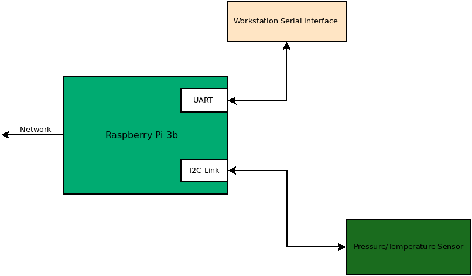
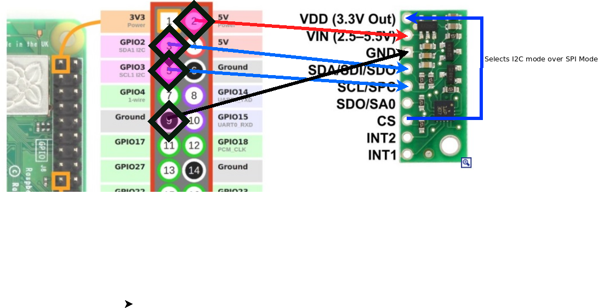
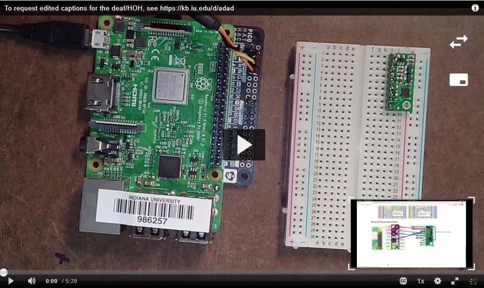
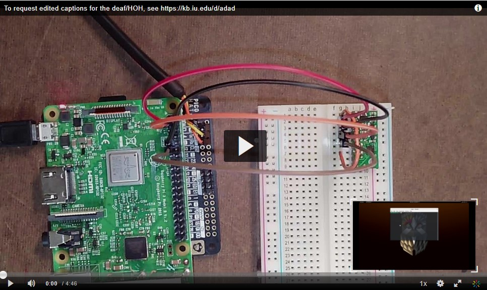
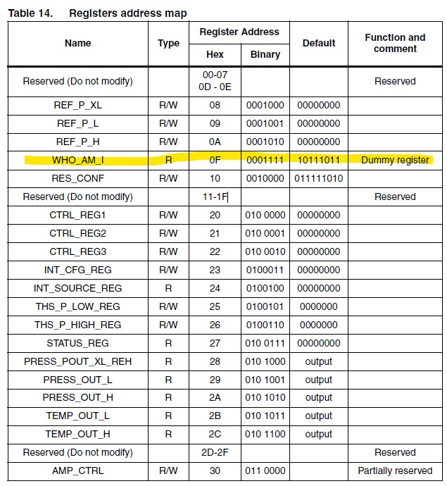
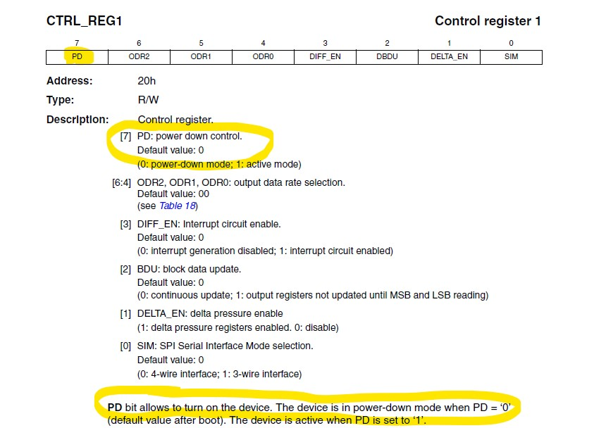
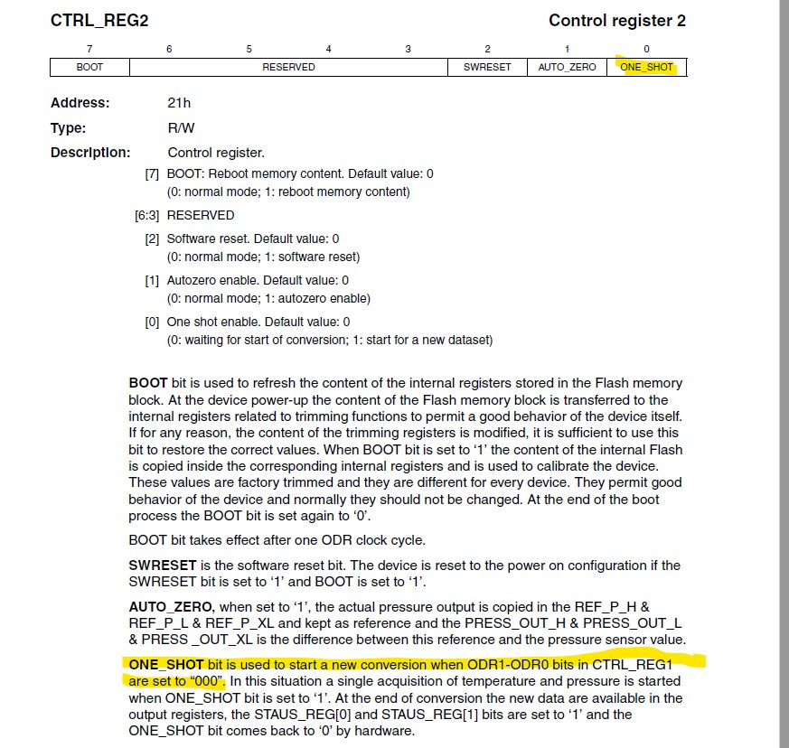
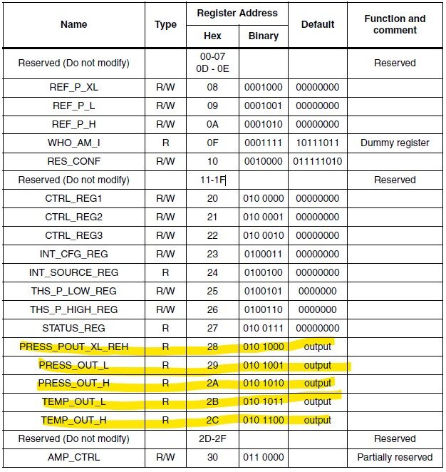

# I2C Introduction

You are in the process of creating a cyber-physical system that will
allow you to interact with sensors from a network. As a reminder, this
is the full system block diagram. You should now what the ability to
talk to your board both through the UART interface and the wireless
network interface.


## Project 1

### Overview

In this project, you will be extending your base Raspberry Pi system
to include a pressure and temperature sensor. The pressure and
temperature sensors are in the same integrated circuit. For this
project, you will be used the ST LPS331AP Pressure Sensor. Because the
component is surface mounted, the LPS331 has been mounted to a PCB by
a company named [Pololu](https://www.pololu.com/). More information
about the carrier board can be found at: * [Pololu LPS331AP Carrier
Board](https://www.pololu.com/product/2126).



### Resources

* [I2C Introduction Lecture](https://engr210.github.io/lectures/I2C_Introduction.pdf)
* [Raspberry Pi I2C Tools](https://www.waveshare.com/wiki/Raspberry_Pi_Tutorial_Series:_I2C)
* [ST LPS331AP Pressure Sensor Datasheet](../docs/LPS331AP.pdf)
* [Pololu LPS331AP Carrier Board](https://www.pololu.com/product/2126)
* [Python Classes](https://docs.python.org/3/tutorial/classes.html)

#### Bread Board 

As part of your kit, you have been provided with ST LPS331 AP pressure
sensor on a carrier board that is plugged into a breadboard. It is
important to rememeber how a breadboard works.

In a breadboard the horizontal holes are connected in groups of 5
pins. There is a divider in the middle of the board that separates the
rows two disconnected segments. Along the sides of the boards there
are two columns (2 on each side) that are connected vertically. These
columns are typically used to route power and ground. Since the P6
circuit is relatively simple, these columns will be unused in this
project.


### Wiring the Pressure Sensor Board

In this section, you will use the provided wires to connect the
pressure sensor to the raspberry pi.

**Important: Remove the usb power plug from the raspbery pi before
starting the wiring. If you make a mistake with the power on, there
will be no time to correct it before damage occurs**

While the I2C connection to the sensor is only two wires, power and
ground need to also be provided to the raspberry pi. In this case, you



[](https://iu.mediaspace.kaltura.com/media/1_r95io33h)

### Raspberry Pi I2C Setup 

You can go ahead and power your raspberry pi board and login. Before
we get to interacting with the sensor, we will need to confirm that
the raspberry pi can see the sensor. We will use the utilities
i2cdetect and i2cdump to interrogate the sensor.

The wiring that was completed in the previous section attached the
sensor to I2C1 of the raspberry pi. The fact that it is on I2C1 will
be important in the call to the utilities.

To determine all of the devices that are connected to the I2C1 device,
you can use the utility i2cdetect.

[](https://iu.mediaspace.kaltura.com/media/1_f508wsxm)

### Reading the whoami register from the sensor 

Now that the sensor is connected and talking to the raspberry pi, we
can focus on writing a python program to pull data from the
sensor. The following is a small program that reads a register from
the sensor.

```python
#!/usr/bin/env python3

import smbus

# Open I2C port 1
bus = smbus.SMBus(1)

# Read register 0x0f from the device at address 0x5d (recall address from i2cdetect)
data = bus.read_byte_data(0x5d,0x0f)

if (data == 0xbb):
    print("Found Sensor")
else:
    print("Received %d from the sensor"%(data))

bus.close()
```

This program relies on the python module smbus. The documentation for
this function can be located in the terminal by typing "pydoc
smbus". This will list all of the functions of the SMBus class defined
in this module.

The program first creates an SMBus object named bus. This object controls I2C bus 1. 

With the bus object, the program can then read and write from devices
on the bus. This is what occurs when one byte is read from address
0x0F inside the pressure sensor (i2c address 0x5d). From the [LPS331AP
Pressure Sensor Datasheet Section 6](../docs/LPS331AP.pdf), this address
is the whoami register. This register alway returns a 0xbb. This is
type of whoami register is typical from a sensor. This allow
communication to validated and the specific chip identified.




### Sampling the pressure and temperature

The LPS331AP pressure sensor wakes up with the sensors disabled. This
is a feature driven by low power systems. Typically only communication
is enabled initially. To enable the other portions of the chip, a bit
typically needs to be set in a control register.

In reading through the [Datasheet](../docs/LPS331AP.pdf), you might have
noticed that the sensor can be enabled through Control Register 1 bit 7. 



To cause the sensor to sample the pressure and temperature, control
register 2 bit 0 needs to be written to a one.



On the setting of control register 2, the sensor will read the pressure and temperature values and store them in registers.



```python 
#!/usr/bin/env python3

import smbus
import sys
import time
import numpy as np

# Open I2C port 1
bus = smbus.SMBus(1)

# Pressure Sensor Address 
address = 0x5d

# Read, modify, and the write back control register 1.
# Notice that bit 7 is being "or"ed to a value of 1. 
ctrl_reg1 = bus.read_byte_data(address,0x20)
bus.write_byte_data(address,0x20,0x80|ctrl_reg1) 

# Show the old values for pressure and temperature
press_xl = bus.read_byte_data(address,0x28)
press_l = bus.read_byte_data(address,0x29)
press_h= bus.read_byte_data(address,0x2a)
print("Old Pressure Bytes 0x%02x 0x%02x 0x%02x"%(press_h,press_l,press_xl))
temp_l = bus.read_byte_data(address,0x2b)
temp_h = bus.read_byte_data(address,0x2c) 
print("Old Temperature Bytes 0x%02x 0x%02x"%(temp_h,temp_l))

# Write Control Register 2 to cause the sensor to sample
ctrl_reg2 = bus.read_byte_data(address,0x21)
bus.write_byte_data(address,0x21,0x01|ctrl_reg2) 
ctrl_reg2 = bus.read_byte_data(address,0x21)

# Poll until the bit that was set control register 2 is cleared. 
while (ctrl_reg2&0x01):
    ctrl_reg2 = bus.read_byte_data(address,0x21)

# Read the pressure and temperature again to get the new values 
press_xl = bus.read_byte_data(address,0x28)
press_l = bus.read_byte_data(address,0x29)
press_h= bus.read_byte_data(address,0x2a)
print("New Pressure Bytes 0x%02x 0x%02x 0x%02x"%(press_h,press_l,press_xl))
temp_l = bus.read_byte_data(address,0x2b)
temp_h = bus.read_byte_data(address,0x2c) 
print("New Temperature Bytes 0x%02x 0x%02x"%(temp_h,temp_l))
bus.close()
```

### Creating the lps331 class

Your assignment is to complete the methods in the following class. 

```python 
#!/usr/bin/env python3

import smbus
import sys

class lps331:
    ''' allows connection from Raspberry pi to I2C connected lps331 '''

    def __init__(self,raspberry_pi_i2c_port=1):
        self.i2c_port_number = raspberry_pi_i2c_port
        self.bus = smbus.SMBus(self.i2c_port_number)
        self.address = self.find_sensor()
        if (self.address == 0):
            print("Error: could not read from sensor at i2c address 0x5d")
            sys.exit()
        self.enable_sensor()
        
    def find_sensor(self):
        ''' read the whoami byte from i2c address 0x5d and confirm to be 0xbb '''
        # Return the address if found (0x5d) and 0 if not found
        
        # @@@@ Your Code Here @@@@ 
        
        return(0);   # if the sensor was not located on either bus, return -1

   def i2c_address(self):
        return(self.address)

    def sample_once(self):
        ''' Cause the sensor to sample one time '''
        
        # @@@@ Your Code Here @@@@ 
        
        pass
        
    def read_temperature(self):
        ''' Sample, read temperature registers, and convert to inhg ''' 
        tempC = 0

        # @@@@ Your Code Here @@@@ 
        
        return(tempC)

    def read_pressure(self):
        ''' Sample, read pressure registers, and convert to inhg ''' 
        press_inhg = 0
        
        # @@@@ Your Code Here @@@@ 
        
        return(press_inhg)
    
    def enable_sensor(self):
        ''' Turn on sensor in control register 1'''

        # @@@@ Your Code Here @@@@ 
     
        pass
    
    def disable_sensor(self):
      ''' Turn off sensor in control register 1 '''

        # @@@@ Your Code Here @@@@ 

        pass
        
    def close(self):
        ''' Disable the sensor and close connection to i2c port '''
       self.disable_sensor()
       self.bus.close()
       
if  __name__ == "__main__":
    sensor = lps331(1)
    print("Temperature = %0.2f Deg C "%(sensor.read_temperature()))
    print("Pressure = %0.2f inHg"%(sensor.read_pressure()))
    sensor.close()
```

To test your code, we will instantiate an lps331 object from your
code. Each method will be tested against a working version of the
code.

### What to turn in 
1) Working code:

- You and your partner should work to complete this module and
commit it to your repository. When you are satisfied with the
code, go to canvas and submit a link to a **video (alternatively demonstrate to one of the TAs present)** printing the temperature and the pressure, and 
the **commit link**.

2) Individual Contributions:

- List down the accomplishments of each member of the group. You should use a `MarkDown` table for this purpose. The table should be formatted similar to the following:

    Date | Time | Contributor | Accomplishment
    -----|------|-------------|---------------
    1/11/2023|3:15 pm| Malintha | Completed the sensor enabling code
    1/11/2023|4:30 pm| Matteo | Completed the sensor temperature sampling code
    1/11/2023|4:45 pm| Caleb | Converted the sensor readings to standard units.

**Both team members should submit to the canvas.**


