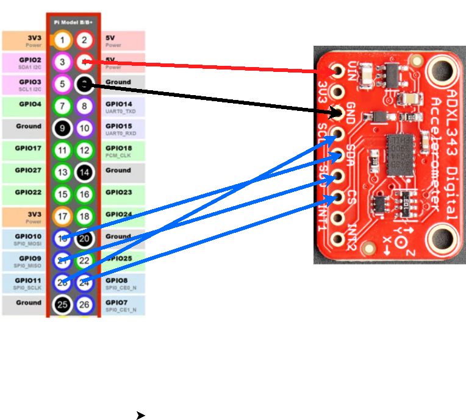

# Connecting the ADXL343 Accelerometer board to the PI 


## Project 2 (DUE 1/28 11:59PM)

### Overview

In this project, you will be connecting an accelerometer board to the
Raspberry Pi. In the last lab, we used I2C to talk to the pressure
sensor. In this lab, we are going to be using Serial Peripheral
Interface (SPI) to connect to the ADXL343 accelerometer. You will be
creating a python class that enables the raspberry pi to interact with
the accelerometer.

### Resources
* [ADXL343 Datasheet](../docs/adxl343.pdf)
* [Adafruit ADXL343 Reference](https://learn.adafruit.com/adxl343-breakout-learning-guide)
* [spidev documentation](https://pypi.org/project/spidev/)

### Connecting the sensor board

You will be adding the accelerometer to the same breadboard as the
pressure sensor. Do not change the connections to your pressure
sensor. At the end of this lab, you should have both sensors wired and
functional.

| Raspberry Pi Pin  | ADXL343 Board  |
|-------------------|----------------|
| 5V                | VIN            |
| GND               | GND            |
| Pin 19 (SPI MOSI) | SDA            |
| Pin 21 (SPI MISO) | SDO/ALT ADDR   |
| Pin 23 (SPI SCK)  | SCL            |
| Pin 24 (SPI CE0)  | CS             |



### Python Class 

Similar to the LPS331 class that you wrote for project 1, you are
going to be writing a class that enables the control of the
accelerometer. You will be completing the following class to enable
the printing of the **floating point** x, y, and z accelerations. You will need to refer to 
the [datasheet](../docs/adxl343.pdf) to complete this work.

```python
#!/usr/bin/env python3

import spidev
import time
import numpy as np

class adxl343:
    ''' Enables communication between the raspberry pi and the ADXL343 board from Sparkfun '''
    def __init__(self,spi_device=0, ce_pin=0, speed=1000000):
        """
        spi_device: there are two spi ports. It is most common to use port 0. 
        ce_pin: there are two CE pins that are automatically controlled by the pi. 
        speed: the speed for the spi clock is specified here. used to limit spi speed. 
        """
        self.spi = spidev.SpiDev()
        self.spi.open(spi_device, ce_pin)
        self.spi.max_speed_hz = speed   # Sets the maximum speed of the SPI link 
        self.spi.mode = 0b11            # Sets the spi clock phase and polarity to mode 3
        time.sleep(0.5)
        if self.get_device_id() == '0xe5':
            self.enable()
            print("found ADXL343")
        else:
            print("Device ID Incorrect")

    def read_register(self, address):
        address = address | 0x80                     # Set the read mode 
        read_bytes = self.spi.xfer2([address,0x00])  # Send the register address and a dummy byte to clock back data
        return (read_bytes[1])

    def write_register(self, address, data):
        self.spi.xfer2([address,data])
        return(0)
            
    def enable(self):
        """ Set the measure bit in the POWER_CTL Register to enable sensor """
        pass
    
    def get_device_id(self):
        """ Read the DEVID register to get back the value of the register"""
        """ Function should return a string that is the output of running the hex function on returned byte"""
        pass

    def read_x_axis(self):
        """ Read the two bytes for the axis, return a floating point g value on a +/-2g scale. """
        pass
        
     def read_y_axis(self):
        """ Read the two bytes for the axis, return a floating point g value on a +/-2g scale. """
        pass

    def read_z_axis(self):
        """ Read the two bytes for the axis, return a floating point g value on a +/-2g scale. """
        pass
    
if  __name__ == "__main__":
    sensor = adxl343()
    while 1:
        print(sensor.read_x_axis(), sensor.read_y_axis(), sensor.read_z_axis())
```

### What to turn in (DUE 1/28 11:59PM)

You and your partner should work to complete this module and commit it
to your repository. When you are satisfied with the code, go to canvas
and submit a link to a video of your code printing the x, y, and z
axis values.
