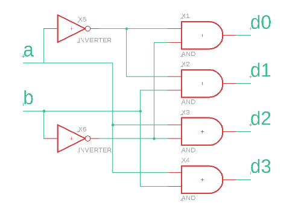
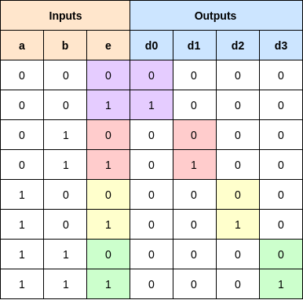
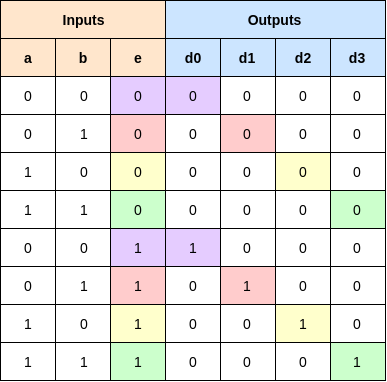
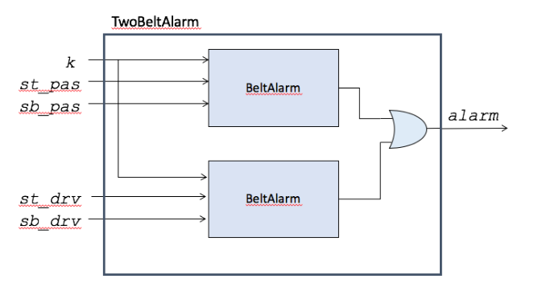
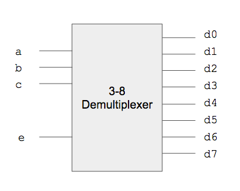
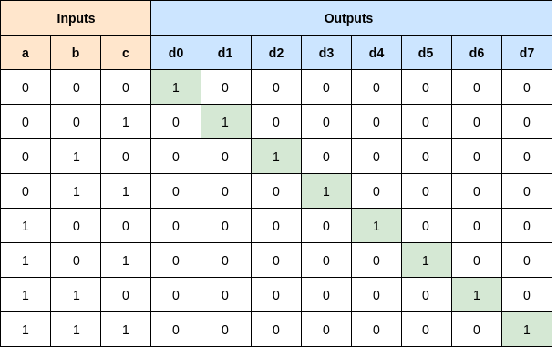

# Project 5: Demultiplexer

## <span style="color:red">Due: Wednesday February 28th</span>


<link rel="stylesheet" href="style.css">

## Table of Contents
1. [Overview](#overview)
2. [Background](#background)
    - [Decoder](#decoder)
        - [Block Diagram](#block-diagram)
    - [Demultiplexer](#demultiplexer)
    - [Verilog Submodules](#verilog-submodules)
    - [Tasks in a Testbench](#tasks-in-a-testbench)
3. [Assignment Description](#assignment-description)
    - [Decoder](#decoder)
    - [Demultiplexer](#demultiplexer)
    - [Top](#top)
    - [Testbenches](#testbenches)
    - [Constraints](#constraints)
4. [Evaluation](#evaluation)
    - [Autograder](#autograder)
    - [Demonstration](#demonstration)

## Overview <a name="overview"></a>

For this project, you will design and implement a 3-to-8 Demultiplexer. Demultiplexers help
control the logical flow of the digital circuit, and are used in addressing memory and many types
of data communication.

## Background <a name="background"></a>

To understand demultiplexers, one should first understand a decoder.

### Decoder <a name="decoder"></a>

A decoder is a combinational circuit with n inputs and 2 n^ outputs. For each combination of
inputs, one and only one output is logic 1, while all the other outputs are logic 0. For example, a
decoder with 2 inputs {a, b} will have 4 outputs {d0, d1, d2, d3}. This circuit is also
sometimes called a " one-hot ", as only one of the outputs is '1' (or hot) at a time.

The truth table for the decoder is shown below.

 

As each output is '`1`' for only a single combination of inputs, a boolean expression that produces
a particular output can be constructed by testing for the specific input combination. For
example, output `d1` is logic <i>1 if and only if</i>:

```
a = 0
b = 1
```

Thus, we can express `d1` as a boolean logic equation:

```
d1 = ~a & b
```

This corresponds to line number `3` in the above truth table (reproduced below):

| a | b | d1 | Boolean Expression: |
| ----------- | ----------- | ----------- | ----------- |
| 0 | 1 | 1 | d1 = ~a & b |

We can define the `d0` through `d3` using a set of boolean logic equations:

```
d0 = ~a & ~b
d1 = ~a & b
d2 = a & ~b
d3 = a & b
```

<b>Note</b> that the notations "<b>~a</b>", "<b>a'</b>", and "<b>ā</b>" are all logical equivalents of the same "<b>NOT(a)</b>".

Now let's write some Verilog for that:

```verilog
module 2_to_4_decoder(
    input a, b,
    output d0, d1, d2, d
);

    assign d0 = ~a & ~b;
    assign d1 = ~a & b;
    assign d2 = a & ~b;
    assign d3 = a & b;

endmodule
```

We can also represent the same 2-input decoder using a circuit schematic, shown below. If you
trace the wires (green lines) you will see the d1 is again equal to `~a & b`.



Notice this is the exact same combination of `NOT` and `AND` that is expressed in the boolean
equations.

#### Block Diagram <a name="block-diagram"></a>

We can abstract our decoder into a "block" that only shows the inputs and outputs. This will
make it easier to use this block later. The inputs are on the left and the outputs are on the right.


### Demultiplexer <a name="demultiplexer"></a>

A demultiplexer is a combinational circuit with <i>1</i> data input, <i>n</i> select inputs and <i>2<sup>n</sup></i> outputs. For
each combination of select inputs, the data is transferred to the selected output, while the other
outputs are `0`. It is very similar to a decoder, except the output signal is dependent on an
additional input, rather than always fixed to '`1`'.

The truth table for a 2-to-4 demultiplexer is shown below. It has `1` data input (e), `2` select inputs
(`a` and `b`), and `4` outputs (`d0 - d3`). The '`e`' signal is used to '`e`'nable the selected output
signal. With a demultiplexer, when <i>a = 1</i> and <i>b = 1</i>, the input `e` is transferred to the output
`d3`, while other outputs are `0`. This is illustrated with the different colors in the truth table below.



We can again express the outputs as a boolean equation. For example, <b>d1 = 1</b> requires `~a &
b & e`. We express that as:

```
d1 = ~a & b & e;
```

Now let's rearrange the Demultiplexer's truth table a little. This is the <i>exact same</i> table, just with
the rows re-arranged:



What we see is that if `e==0` all of the outputs are always `0`. If `e==1`, then the outputs match
the decoder exactly. So, that suggests we can use the decoder to generate some of the signals
required for the demultiplexer.

### Verilog Submodules <a name="verilog-submodules"></a>

Submodules in Verilog allow you to use smaller modules as building blocks for constructing
more complex modules. Recall from the lecture that we can construct a TwoBelt Alarm system
by creating two BeltAlarm submodules, as shown below.



In Verilog, we recommend using this method to construct submodules:

```verilog
SubModuleName SubModule_InstanceName (
    .subModuleVariableName1(localVariableName1),
    .subModuleVariableName2(localVariableName2)
);
```

`SubModuleName` is the name as it appears in the submodules verilog file. It will be the same
for all instances of the submodule. `SubModule_InstanceName` is the name given for a
particular submodule instance. You can instantiate multiple of the same submodules, but they
must have different `InstanceNames`. `subModuleVariableNames` signals must match
those given in the submodule's verilog file. `localVariableNames` signals must match a
signal in the current module (not the submodule).

If `BeltAlarm` looks like this:

```verilog
module BeltAlarm(
    input k, p, s,
    output alarm
);
    assign alarm = k & p & ~s;

endmodule
```

Then you can create a `TwoBeltAlarm` by instantiating two `BeltAlarm` modules as shown
below. Notice that there are two `BeltAlarm` modules, but they both have different names,
`ba_drv` and `ba_pas`. Also, their output is `OR`'ed together to form the output of the overall
`TwoBeltAlarm` module

```verilog
module TwoBeltAlarm(
    input k, st_pas, sb_pas,
    input st_drv, sb_drv
    output alarm
);
    wire al_pas, al_drv; //intermediate wires

    //submodules,
    BeltAlarm ba_drv(.k(k), .p(st_drv),
    .s(sb_drv), .alarm(al_drv) );
    BeltAlarm ba_pas(.k(k), .p(st_pas),
    .s(sb_pas), .alarm(al_pas));

    assign alarm = al_pas | al_drv;

endmodule
```

As an optional optimization, if the name inside the parentheses matches the name outside the
parentheses, like .k(k), you can skip the parentheses, and just write the name, like .k. With the
optimization, our verilog looks like this:

```
module TwoBeltAlarm(
    input k, st_pas, sb_pas,
    input st_drv, sb_drv
    output alarm
);
    wire al_pas, al_drv; //intermediate wires

    //submodules,
    BeltAlarm ba_drv(.k, .p(st_drv), // .k optimized
    .s(sb_drv), .alarm(al_drv) );
    BeltAlarm ba_pas(.k, .p(st_pas), // .k optimized
    .s(sb_pas), .alarm(al_pas));

    assign alarm = al_pas | al_drv;

endmodule
```

### Tasks in a Testbench <a name="tasks-in-a-testbench"></a>

Using tasks to create an exhaustive testbench will prove useful as the course projects increase
in difficulty. You may wish to use tasks in this project to begin understanding how they work as
well as their purpose, however it is not required.

Tasks make your testbench code cleaner to read and easier to debug.

To use a task you must first define it, here you declare the inputs and outputs of the task, any
operations it should do, and assert statements for any output you would like to check. Then you
can call the task. For more details on how to use tasks check this link:
[Nandland](https://www.nandland.com/verilog/examples/example-task-verilog.html)

```verilog
//Task Declaration

task task_name;
    input a,b;
    output outData;

    //operations/algorithms
    //assert to check output
endtask

//Using a task
initial
    begin
    //your testcode here!
    //set input for task
    my_and(1,0,0);
    #1;
    my_and(0,1,1);
    #1;
end

endmodule
```

Here's an example of a task you might find helpful for this project. This will set "test" values for
`a,b,c,` and `e`. It will then test `d0-d3` against `d0T-d3T` to ensure the output is as expected.

```verilog
task demux_test;
    input aT, bT;
    input d0T, d1T, d2T, d3T;

    #5
    a = aT; b=bT;
    #5
    assert( ( d0 == d0T ) && ( d1 == d1T ) &&
    ( d2 == d2T ) && ( d3 == d3T ) )
    else $fatal(1,"demux0(%b,%b) failed!", a, b);
endtask
```

You can call a task from within your initial block just like it's a C function

```verilog
initial
begin

    //your testcode here!
    $monitor("%h%h%h%h", d0,d1,d2,d3);

    demux_test (0,0, 0,0,0,0);

    $display("@@@Passed");

    $finish;
end
```

## Assignment Description <a name="assignment-description"></a>

For this assignment, you will 
    - create a 3-8 decoder
    - use your decoder as a submodule in a 3-8 demultiplexer
    - create corresponding testbenches



### Decoder <a name="decoder"></a>

First, start by creating a SystemVerilog file named decoder.sv defined as follows:

```verilog
module decoder(
    input a, b, c,
    output d0, d1, d2, d3, d4, d5, d6, d7
);
```

You will need to assign the correct expressions for the outputs `d0-d7` in a similar pattern as the
2-4 decoder of the Background section. For example, `d0` should be active when
`a=0,b=0,c=0, d1` should be active when `a=0,b=0,c=1,` and `d7` should be active when
`a=1,b=1,c=1`. The truth table for the decoder is provided below:



### Demultiplexer <a name="demultiplexer"></a>

Now create a `demux.sv` that will serve as your demultiplexer by including the `e` signal.

```verilog
module demux(
    input a, b, c,
    input e,
    output d0, d1, d2, d3, d4, d5, d6, d7
);
```

You will now need to instantiate a decoder submodule within your top-level demultiplexer
module. See the Background section for an example. Additional signals internal to your
demultiplexer can be created with the wire command as follows:

```verilog
    wire wire1; //declare a wire
    assign wire1 = 'h1; // assign to 1
    wire wire2 = 'h1; //declare and assign
```

Your demultiplexer module will need to modify the outputs for the decoder's `d0-d7` signals for
its own `d0-d7` outputs. Remember the corresponding `d` output should be `0` when `e==0`, and
the same as the original decoder when `e == 1`.

### Top <a name="top"></a>

Please use the following `top.sv`. This uses arrays, which we will discuss more in class later.

```verilog
`timescale 1ns / 1ps

module top(
    input [15:0] sw,
    output [15:0] LED
);

demux d0 (
    .a(sw[0]),
    .b(sw[1]),
    .c(sw[2]),
    .e(sw[4]),
    .d0(LED[0]),
    .d1(LED[1]),
    .d2(LED[2]),
    .d3(LED[3]),
    .d4(LED[4]),
    .d5(LED[5]),
    .d6(LED[6]),
    .d7(LED[7])
);
    assign LED[15:8] = 'h0;

endmodule
```

### Testbenches <a name="testbenches"></a>

You will need to create two testbenches to test your code, one for decoder and one for demux.

The first testbench should be named `decoder_tb.sv`. <ins>Remember to select "System Verilog"
from the "File Type" drop-down menu</ins>. You can use the following starter code:

```verilog
`timescale 1ns/1ps

module decoder_tb;

    logic a, b, c;
    logic d0,d1,d2,d3,d4,d5,d6,d7;

    decoder dec0 (
        .a(a),
        .b(b),
        .c(c),
        .d0(d0),
        .d1(d1),
        .d2(d2),
        .d3(d3),
        .d4(d4),
        .d5(d5),
        .d6(d6),
        .d7(d7)
    );

    task decoder_test;
        input aT, bT, cT;
        input d0T, d1T, d2T, d3T, d4T;
        input d5T, d6T, d7T;
        #5
        a = aT; b=bT; c=cT;
        #5
        assert( ( d0 == d0T ) && ( d1 == d1T ) &&
        ( d2 == d2T ) && ( d3 == d3T ) &&
        ( d4 == d4T ) && ( d5 == d5T ) &&
        ( d6 == d6T ) && ( d7 == d7T ) )
        else $fatal(1,"dec0(%b,%b,%b) failed!", a, b, c);
    endtask

    initial
    begin
        a = 0; b = 0; c = 0;
        #10

        $monitor("%h%h%h%h%h%h%h%h", d0,d1,d2,d3,d4,d5,d6,d7);
        decoder_test(0,0,0, 1,0,0,0,0,0,0,0);

        //more test cases here!

        $display("@@@Passed");
        $finish;

    end
endmodule
```

The Second test bench should be named `demux_tb.sv` <ins>Remember to select "System Verilog"
from the "File Type" drop-down menu</ins>. You can use the following starter code:

```verilog
`timescale 1ns / 1ps
module demux_tb;

    logic a, b, c;
    logic e;
    wire d0,d1,d2,d3,d4,d5,d6,d7;

    demux demux0 (
        .a(a),
        .b(b),
        .c(c),
        .e(e),
        .d0(d0),
        .d1(d1),
        .d2(d2),
        .d3(d3),
        .d4(d4),
        .d5(d5),
        .d6(d6),
        .d7(d7)
    );

    initial
    begin

        //your testcode here!

        $display("@@@Passed");
        $finish;

    end
# endmodule
```

Your testbench should ensure the correct output for all 16 possible input combinations of `a`, `b`,
`c`, and `e`. Recall, you can use the following verilog line to test a signal:

```verilog
assert( led == 0) else $fatal(1, "led==0 Failed");
```

We encourage you to use tasks to aid in testing.

If you miss an input combination, the autograder will likely detect it during testing.

### Constraints <a name="constraints"></a>

You will also need to reconfigure your constraints file so it uses the correct assignments of
switches and LEDs. Rather than writing your own, we recommend you copy the default
constraints file from here:

[Basys3 Constraints](https://raw.githubusercontent.com/ENGR210/downloads/master/Basys3_Master.xdc)


And edit it for our needs. Specifically, you will need to uncomment the appropriate line to enable
the various switches and leds needed.

## Evaluation <a name="evaluation"></a>

The evaluation will have two steps: 
 1. Submit your source code and testbench to the autograder.  
 2. Synthesize your design, download it to the FPGA and do a demonstration for the TA.

### Autograder <a name="autograder"></a>
<div id="urlLink">
   <a href="https://autograder.luddy.indiana.edu"> Autograder </a> 
</div>

To submit your code, 
- Follow the above link to the Autograder website.  
- Log on using your **@IU.edu email address** 
- You should now be at a page that looks something like this: 

    

- Drag or upload the files listed below into the submission window. These files
  can be found under the sources (`.srcs`) subfolder in your Vivado Project's build folder.  

- You should submit:
  - `decoder.sv`
  - `decoder_tb.sv`
  - `demux.sv`
  - `demux_tb.sv`

- Click Submit
- You should now be taken to the ‘My Submissions’ window, where the results of your submissions will be shown shortly.  It should look something like this:

    

- This page will display the score for each of the modules that are tested as well as an overall score.  

### Demonstration (30%) <a name="demonstration"></a>

Program your FPGA with your demultiplexer and demonstrate your working system to the TA.  You will not receive full points until the TA has approved your demonstration.  


----
Version:  E210 SP'2024
