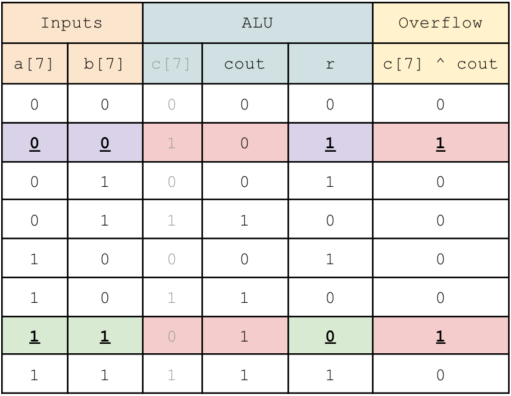

# Project 6: Arithmetic Logic Unit

<link rel="stylesheet" href="style.css">

## <span style="color:red">Due: Wednesday March 6th</span>

## Overview

You will design and implement an 8-bit **Arithmetic Logic Unit (ALU).** You can use the same design procedure to expand to a functionally complete 16-, or 32-bit ALU. You will also get to implement a basic **D Flip-Flop.** Flip Flops are used to add state to your digital systems.

## Background

### Arrays

For the last project, we expressed the `d` outputs of the decoder seperately:

```verilog
module decoder (
    input a, b, c,
    output d0, d1, d2, d3, d4, d5, d6, d7
    );
```

However it is also possible to combine them into a single array of wires:

```verilog
module decoder (
    input a, b, c,
    output [7:0] d
    ); 
```

Note that the array definition is of the form:

    type [mostSignificantIndex:leastSignificantIndex] name;

Thus, the big index goes on the left, and the smaller index (typically 0) on the right, *It is possible to create arrays differeing from this convention, but we do not recommend it.*

Individual wires can be accessed with the standard array syntax "[ ]" that you've seen from C or Python:

```verilog
assign d[1] = ~a && ~b && c;
wire wire1 = d[0] ^ d[1];
```

You can also access groups of bits from within an array using the colon slicing similar to Python. For example, this will access bits 5, 4, and 3 from d and assign them to bits 2, 1, and 0 of `other_wire2`.

```verilog
    wire [2:0] wire2 = d[5:3];
```

A few other useful array operations are concatenation and static assignment. Concatenation lets you join multiple signals together to create an array using curly-brackets. The following example joins three wires (`a, b,` and `c`) to make a 3-wire array `wire3`.

```verilog
    wire [2:0] wire3 = { a, b, c }; //concatenation
```

Static assignment lets you fix a wire to a given logical value, for example 1. The `'h` prefix is Verilog's method of specifing hexadecima. Recal that C and Python 3 use the "`0x`" prefix. You can also use `'b` to specify a binary number.

```verilog
    wire wire4 = 'h0; // static assignment
    wire [2:0] wire5 = 'b010; // also static assignment
    wire [2:0] wire6 = { 'b0, 'b1, 'b0 }; // static + concatenation
``` 

Sometimes it's helpful to specify the number of bits for a number. You can do this by placing the number of bits for a number ahead of the `'h`. In the following example, we specify that the first number is two bits wide, and the second number is only 1 bit wide.
```verilog
    wire [2:0] wire6 = { 2'b1, 1'b0 }; // binary 01 & 1
```
### Case Statements

Another piece of new Verilog for this lab is the `case` statement. Just like C, verilog lets you use case statements. The syntax looks something like this:

```verilog
case(sel)
    
    2`b00: out = input[0]; // set out = input[0] when sel == 00
    2`b01: out = input[1]; // set out = input[1] when sel == 01
    2`b10: out = input[2]; // set out = input[2] when sel == 10
    2`b11: out = input[3]; // set out = input[3] when sel == 11
    default: out = input[0]; // you usualy want a default case

endcase
```

### Combinational Always Blocks

Unfortunately, you cannot use `case` statements with `assign`, it must be inside a special block called `always_comb`. The comb is short for combinational. `always_comb` blocks look like this:

```verilog
always_comb begin
    out = input[2];
end 
```

`always_comb` blocks run all of the commands between `begin`//`end` every time something on the right-hand side of any contained equation changes. In the above block, the right-hand-side is shown in bold. That means whenever anything changes, verilog wil re-evaluate *all* the block's assignments. The above block is functionally equivalent to `assign out = input[2];`

As Verilog is an odd language, and <mark style="background-color: lightred">you cannot assign a value to a 'wire' inside an always block.</mark> Therefor we declare `out` as a `logic` type. There are subtle differences between wire and logic, but for now just remember that everything inside an always block must be declared `logic`.

If we put the always block and the case statement together, we get something that looks like this:

```verilog
logic out; //must be logic (or reg) for always blocks

always_comb begin

    out = 1'h0; //default
    case(sel)
        
        2`b00: out = input[0];
        2`b01: out = input[1];
        2`b10: out = input[2];
        2`b11: out = input[3];
    
    endcase
end
``` 

This lets us set `out` to one of 4 values based on the value of `sel` (or select). This is one way to build a 4-1 multiplexer.

### Flip-Flop Always Blocks

One final piece is how to build D Flip Flops in Verilog. Here again we make use of an always block, but this one looks a little different.

```verilog
wire clk, D;  //input signals
logic Q, Qbar;//must be logic (or reg) for always blocks

//D Flip Flop

always_ff @ (posedge clk)
begin
    Q    <=  D;
    Qbar <= ~D; //optional
    
end
```

Notice this always block is an `always_ff`, "**ff**" is short for "flip-flop". It also includes `@(posedge clk)` or "at the positive edge of clock". This means only the positive (rising) edge of clk will cause signals inside the always block to chane. A positive edge is when a signal which was 0 (a low voltage) rises to 1 (a high voltage). Thus, there is a "positive" or "rising" edge in the waveform. Unless `clk` is rising (going from 0 to 1), none of the outputs will change. This is what makes this block into a flip flop. As `Q` and `Qbar` can hold state, they must be declared as logic or the older reg. Also notice the use of the **non-blocking assignment (<=)**. We will discuss this more in class, but the rule is:

## <span style="color:red">`always_comb` is for __combinational__ logic and __ONLY USES BLOCKING ASSIGNMENTS__ (=)</span>
## <span style="color:red">`always_ff @(posedge ...)` is for __sequential__ logic and __ONLY USES NON-BLOCKING ASSIGNMENTS (<=)__</span>

## <span style="color:red">DEBUGGING PAIN __WILL__ RESULT IF YOU BREAK THE ABOVE RULE!!</span>

Verilog being an odd language, the tools will not check for this, and are more than happy to let you do whatever you want. Then you won't understand why your FPGA does not behave as you expected. <span style="color:red">If you get a warning that says "inferring latch", you broke the rule!</span>

There are several other `always` blocks in Verilog. For now, don't use them.

### Flip-Flop Always Blocks with Enable

The previous flip-flop block always updated its state on every rising edge of clk. However, often you want to control that slightly, so that it only updates the value when you enable it. For that, we add a little more logic to the always_ff block:

```verilog
wire clk, D;    //input signals
**wire e;       //enable input**
logic Q, Qbar;  //must be logic (or reg) to retain state

//D Flip Flop
always_ff @(posedge clk)
begin
    **if (e) begin //only update if enabled**
        Q    <=  D;
        Qbar <= ~D; //optional
    end
end
```

## ALU

You will build an ALU that takes two inputs; `a` and `b`, and produces three outputs: `r`, `c`, and `v`. Additionally, another input `s` will `s`elect which type of operation should be performed. Your ALU will be capable of both Arithmetic and Logical operations.

### Arithmetic

Your ALU should be capable of both **addition** and **subtraciton**. We'll assume you've seen digital addition before. Subtraction in the digital world can be implemented using addition and 2's complement.

$$
r = a - b = a + \bar{b} + 1
$$

Thus, by inverting *b* and adding 1, we can implement subraction. Now that we are also doing subtraction, we have chosen to express the `r`esult as *__`r`__* rather that *`s`* for sum.

There are a number of different ways to build adders. **In practice, it is typically easiest to use the built-in Verilog addition operator (+) or subtraction operator (-) and let the tools figure it out.** Unfortunately, Verilog's built-in addition operator, by devault, assumes an 8-bit addition and results in an 8-bit sum. However, we want the carry-out, so we need a 9-bit sum. ::The solution is to prepend a 1-bit `0` to your 8-bit value to form a 9-bit value. We can use the concatenation operator in Verilog to achieve this.::

```verilog
wire [7:0] a = 8`hff;
wire [8:0] a9 = {1`h0, a}; //concatenation of inputs

wire [7:0] r;
wire r9;
{r9 ,r} = a9; //concatenation of outputs
```

Notice for `a9` we're mashing the `wire` declaration and the `assign`-ment statement together into a single line. 

In addition, your ALU should be capable of several other helpful functions

**Transfer:**       $$r = a$$

**Test:**           $$r = (a == 0)$$

### Logic

Your ALU should also be capable of 4 basic bitwise logic operations, **AND**, **OR**, **NOT**, and **XOR**. These are computed to all bits of `a` and `b`.

### Operation Encoding

To select which operand your ALU should perform, you will need to read in a 4-bit "operation select" value (here named `s`). The mapping of `s` values to operations is given below:


| *s*  | *Operation* | *Result* |
| :-:  | :---------: | :------: |
| 1110 | AND | $$r = a \land b$$ |
| 1101 | OR  | $$r = a \| b$$ |
| 1100 | NOT | $$r = \bar{a}$$|
| 1011 | XOR | $$r = a \oplus b$$ |
| 1010 | Addition | $$r = a + b$$ |
| 1001 | Subtraction | $$r = a - b$$ |
| 1000 | Transfer | $$r = a$$ |
| 0111 | Test | $$r = (a == 0)$$ |


### Carry 

Recall that 8-bit unsigned addition can result in a 9-it sum. Therefore, the highest bit shoulde be returned in the `c` bit, short for Carry. __this bit must be 0 for transfer, test, and all logic operations.__

### Overflow

Additionally, signed arithmetic can result in overvlows. This can occur when ading two positive numbers, and receiving a negative result. Or when adding two negative numbers resulting in a positive number. This overflow condition should be captured in a `v` bit, short for oVerflow. ::__This bit must be correct for addition and subtraction and is `undefined` for all other operations.__ If a signal is `undefined`, you can set it to whatever you want.::

:: SP'21 The autograder now sets `c` and `v` to 0 for all operations other than Addition or Subtraction ::

There are two ways to calculate overflow. The one discussed in class is using an XOR gate between the carry-out and the last internal carry bit of the addition/subtraction. For an 8-bit addition, this would be $$v = c_{out} \oplus c_{7}$$. Unfortunately, if you use the Verilog subtraction operator (-), you will not have a $$c_{7}$$.

The second way is to look at both the inputs and the result. If you construct a truth table for `a[7], b[7], c[7], cout,` and `r`(esult), it will look something like this



Recall the `v = c[7] ^ cout`. Which means it is true whenever `c[7]` and `cout` differ. Notice, there are two cases above where `c[7]` and `cout` differ, highlighted in red above. Those two cases are shown in red above. The first case occurs when `a[7] == 0`, `b[7] == 0`, and `result[7] == 1`. This occurs when we are adding two positive numbers, and the result is negative. The second case occurs when `a[7] == 1`, `b[7] == 1` and `result[7] == 0`. Now we are adding two negative numbers and getting a positive result. We can write a Verilog expression to capture these two cases:

```verilog
wire oVerflowAdd = ~a[7] & ~b[7] & r[7] | a[7] & b[7] & ~r[7];
```

Recall with subraction that $$A - B = A + \bar{B} + 1$$. Therefor, Verilog will flip the bits of `b` to form `~b`. It will then perform `(count, result[7]) = a[7] + ~b[7] + c[7]`. As part of the project, you will need to compute a similar overflow eqution for subtraction:

```verilog
wire oVerflowSubtract = ??? ;
```

Hint: the solution can be found in the textbook

## Assignment Description

### 8-Bit ALU

Create a Verilog file named `alu.sv` which defines a module as follows:

```verilog
module alu(
    input        [7:0] a, //operand
    input        [7:0] b, //operand
    input        [3:0] s, //operation Select
    
    output logic [7:0] r, //the Result value
    output logic       c, //for unsigned Carry
    output logic       v //for signed oVerflow
);
```

The `logic` keyword is optional and can be omitted.

Your task is to implement the ALU as per the specifications above

### Top-Level

Please use the following `top.sv`:

```verilog
`timescale 1ns / 1ps

module top(
    input           CLK100MHZ,
    input   [15:0]  sw,    //operands a, b, s
    input           btnC,  // 
    output  [15:0]  LED   //results c, v
);

    logic [7:0] a;

    always_ff @(posedge CLK100MHZ) begin
        if (btnC)
            a <= sw[7:0];
    end

    alu alu0(
    .a(a),
    .b(sw[7:0]),
    .s(sw[11:8]),
    .r(LED[7:0]),
    .c(LED[8]),
    .v(LED[9])
    );

    assign LED[15:12] = 5'b0;

endmodule
```

This module includes an 8-bit value that stores the value of `a` in flip flops.

```verilog
logic [7:0] a; //a state-holding register for a
```

This module incorperates flip-flops that capture `sw[7:0]` and stores it to `a[7:0]` when the `btnC` button is pressed. This will capture the first input (`a`) for the ALU and store it, allowing you to reset `sw[7:0]` for the second input to the ALU (`b`).

You will then need to reconfigure `sw[7:0]` for the second input, and set the select inputs to perform the apropriate ALU operation.

As some of the `LED` values are unused, we assign them to `0` (off).

__*Remember to select "System Verilog" from the "File Type" drop-down menu.*__

### Testbench

For this project, you only need to create a testbench for your ALU. It should be named `alu\_tb.sv`.

__*Remember to select "System Verilog" from the "File Type" drop-down menu.*__

### MAKE SURE YOU HAVE "$display("@@@Passed");" AT THE END OF YOUR TESTBENCH! AND $fatal IN THE APPROPRIATE SPOT! Otherwise some bugs may not pass!

### Constraints

We recommend you copy the default constraints file from here:

[Basys3 Constraints](https://raw.githubusercontent.com/ENGR210/downloads/master/Basys3_Master.xdc)

You will also need to reconfigure your file to align with the top-level module declaration. The names should line up properly by default.

## Evaluation

The evaluation will have two steps; first,the submission of your source code and testbench to the autograder. Second, you will need t osynthesize your design, download it to the FPGA and do a demonstration for the TA.

### Autograder (70%)

Log onto to [https://autograder.luddy.indiana.edu](https://autograder.luddy.indiana.edu) and submit your code as per previous projects. 

You should submit:
* `alu.sv`
* `alu_tb.sv`
* `top.sv`

### Demonstration (30%)

Program your FPGA with your ALU, and demonstrate your working system to the TA. You will not recive full points until the TA has approved your demonstration.
