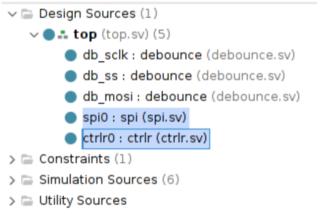

# Project 9: Serial Peripheral Interface (SPI)

## <span style="color:red">Due: Sunday, April 19th</span>

## Overview

In this lab you will construct a Serial-Peripheral Interface (SPI) link between the Basys3 FPGA
and a Raspberry Pi.

## Introduction

You are in luck. We finally automated the Vivado project creation step. Please open a terminal
on the 4111 machines and type the following instructions to get started:

```bash
git clone https://github.com/ENGR210/P9_SPI.git 
cd P9_SPI
make setup
vivado vivado/vivado.xpr
```

That should create the vivado project for you and start vivado with the project open.

## Assignment Description

Under the project's "Design Sources", you should see `spi.sv` and `ctrlr.sv`. These files need modification:



### SPI

The definition and a partially-complete stub of the SPI module need to be extended to
implement SPI. See Appendix I below for additional implementation details.

```verilog
module spi(
    input               clk,
    input               rst,

    //SPI signals
    input               sck,
    input               ss,  //acts like reset
    input               mosi,
    input               miso,

    //hw interface
    input        [7:0]  dout, //output to SPI
    output logic [7:0]  din   //input from SPI
);
```

### Ctrlr

The definition and a partially-complete stub of the Controller module need to be extended to
implement the control interface. See [Appendix II](#appendixii) below for additional implementation details.

```verilog
module ctrlr(
    input                  clk,
    input                  rst,
    
    //GPIO interface
    input           [15:0] switches,
    input           [15:0] leds,
    
    //MMIO interface
    input                  new_data,
    input           [7:0]  din,
    input logic     [7:0]  dout
);
```
**All remaining files in the Vivado project do not require any modification**

### Testbenches

For this project, **we provide you with all needed testbenches**


* `Sim_ctrlr`: This tests just the `ctrlr` (controller) interfaces
* `Sim_spi`:   This tests just the SPI interface
* `Sim_top`:   This tests the top-level design, including both the ctrlr and SPI sub-modules

To switch which simulation is active, right click and select 'make active':


## Raspberry Pi

### Hardware Connections

Once passing all testbenches, connect your Raspberry Pi to your Basys3 using the following pin
mappings:

| **SPI Signal** | **VIVADO SIGNAL** | **Basys3 Pin** | **Raspberry Pi Pin** |
|:-------------: | :---------------: | :------------: | :------------------: |
| SCLK | `JC[6]` | JC9 | 23 |
| MOSI | `JC[5]` | JC8 | 19 |
| MISO | `JC[4]` | JC7 | 21 |
| SS / CE0_N | `JC[7]` | JC10 | 24 |
| GND | - | JC11 | 25 |


### Python

Once the wiring is complete, open a terminal on your Pi and type the following:

```bash
git clone https://github.com/ENGR210/P9_SPI.git
cd P9_SPI/pi
python3 spi.py
```

## Evaluation
The evaluation will have two steps:
* Submit your FPGA code to the autograder
* Synthesize your design, download it to the FPGA and do a demonstration for the TA.

### Autograder (60%)
Log on to [https://autograder.luddy.indiana.edu](https://autograder.luddy.indiana.edu) and submit your testbench code.

### Demonstration (40%)

Program your FPGA with your SPI controller and demonstrate your working system to the TA.
You will not receive full points until the TA has approved your demonstration.


## Appendix I: SPI Interface

Conceptually, SPI is a shift register between two devices. In our case, the Rasperry Pi is the
Master and the Basys3 is the slave in the in the figure below.


[wiki](https://en.wikipedia.org/wiki/Serial_Peripheral_Interface#/media/File:SPI_8-bit_circular_transfer.svg)

A SPI transmission looks like the following figure:


[mathworks](https://www.mathworks.com/help/supportpkg/arduino/ug/arduino_fullduplex_spi_tranmission.png)


When writing Verilog for the SPI slave interface, here are a few major items
to note:
1. The INCOMING data (`MOSI`) is captured on the RISING edge of
`SCLK`.
2. OUTGOING data (`MISO`) is updated on the FALLING edge of `SCLK`.
3. In class, data is transferred from MSB to LSB. MSB is the most significant bit (`data[7]`). LSB is the least significant bit (`data[0]`).

### Explanation of Signals

The SPI module contains the following signals:

| **Signal** | **Explanation** |
| :--------  | :-------------  |
|`clk` | The Basys3's 100MHz clock|
|`rst` | The Basys3's reset signal|
|`sck` | The SPI's Serial Clock. This is ~10MHz|
|`ss` | The SPI’s Slave Select signal. When this is high, the SPI is inactive (reset). When it is low, the SPI is active.|
|`mosi` | This is the SPI’s Master-Out-Slave-In signal. This signal comes from the Raspberry PI and comes into the Basys3|
|`miso` | This is the SPI’s Master-In-Slave-Out signal. This signal comes from the Basys3 and goes to the Raspberry Pi.|
|`dout` | This is the SPI’s 8-bit parallel data **output** to the remainder of the Basys3. This signal is connected (through top) to the controller interface. It is used to drive new data to the controller.|
|`din`| This is the SPI’s 8-bit parallel data **input** from the Basys3. This signal is connected (through top) to the controller interface. This allows the controller to drive new data out over SPI.|
|`done`| This signal is used to tell the controller that a new byte has been received over SPI. *It should go high for 1 cycle after the completion of the SPI transmission.*|

### Example Waveform


## Appendix II: Controller Interface <a name="appendixii"></a>

The Controller (or Ctrlr) interface implements a 2 byte read/write interface that allows SPI to
interact with the Basys3’s switches and LEDs.

### Address Mapping

The Controller makes the switches and LEDs accessible via an address mapping detailed
below. The Read and Write sequences (detailed below) are used to access the various
addresses.

| **Address** | **Mapping** | **Type** |
|-----|-----|----|
|`7'h00` | `chip_id (8'h7)` | Read-Only|
|`7'h01` | `switches[7:0]`  | Read-Only|
|`7'h02` | `switches[15:8]` | Read-Only|
|`7'h03` | `leds[7:0]`      | Read/Write|
|`7'h04` | `leds[15:8]`     | Read/Write|

**Note: Writes to addresses with Read-Only type should be ignored**

### Write Sequence

For Writes, the Pi (Master) writes a new value to the Basys3 (slave) using a 2-byte sequence.
The first byte sent is the address and the second byte is the data. For a write, set R/W = 0. For a write, the Basys3 can respond back with any values (including all 0) over MISO. Both
unneeded bytes are ignored.


[pyroelectro](http://www.pyroelectro.com/tutorials/spi_master_slave/spi_theory.html)

### Read Sequence

For Reads, the Pi (Master) reads a value from the Basys3 (slave) using a 2-byte sequence. The
first byte sent is the address, with R/W = 1. The Basys3 responds back with the desired data on the second byte. For Reads, the Basys3 can respond back with any values (including 0) for the
first byte while the Pi can transmit any value for the second byte. Both unneeded bytes are
ignored.


[pyroelectro](http://www.pyroelectro.com/tutorials/spi_master_slave/spi_theory.html)

### Explanation of Signals

| **SIGNAL** | **Explanation** |
| :--------: | :-------------: |
| `clk` | The Basys3’s 100MHz clock |
| `rst` | The Basys3’s reset signal |
| `switches[15:0]` | The digital input from the Basys3’s switches. There are 16 switches. |
| `leds[15:0]` | The digital output to the Basys3’s LEDs. There are 16 LEDs. |
| `new_data` | This signal indicates new data has arrived from the SPI interface. It should be high for 1 cycle to indicate new data from SPI. It is connected to the SPI’s `done` signal.|
| `din` | This is the SPI’s 8-bit parallel received data (MOSI) coming into the Controller. It is used to receive data from the Raspberry Pi. **`new_data` should be high for 1 cycle to indicate valid data on din**.|
| `dout` | This is the Controller’s 8-bit parallel transmit data going to SPI transmit (MISO). It is used to drive new data back to the Raspberry Pi.|

### Example Waveforms

Overall Waveform


Read Waveform


Write Waveform


